# Smartphone Game Programming (Android) Term Project
2024년 [한국공학대학교](https://www.tukorea.ac.kr/) 게임공학부 \"스마트폰 게임 프로그래밍\" 텀 프로젝트입니다.  

# 게임 기획
<b>게임 제목: 티노의 낙하 실험</b>

## 1. 게임 컨셉
> 한손으로 즐길 수 있는 간단하고 부담 없는 게임

티노가 자신이 직접 만든 낙하산의 성능을 알아보기 위해 직접 낙하산을 차고 하늘 위에서 떨어져 낙하산이 얼만큼 버티는지 알아보려고 한다. 티노의 실험을 도와주자!

### 1.1. 게임 월드 상세

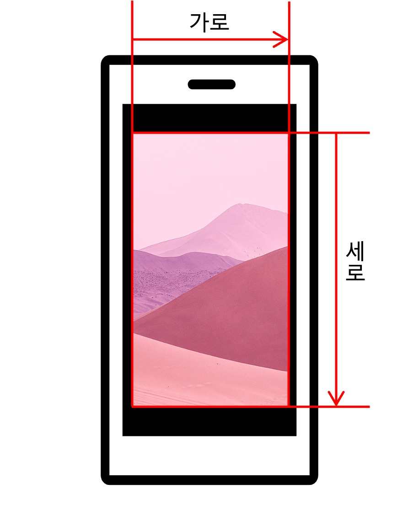 

- 게임 월드는 가로 9m, 세로 16m의 크기를 갖는다.
- 스마트폰은 세로로 고정되며, 스마트폰 가로 해상도에 맞춰 크기가 조정된다.
- 게임 월드를 채우고 남은 여백의 공간은 검은색으로 채운다.
- <b>게임의 좌표는 왼쪽 상단을 중점으로 오른쪽과 아래쪽으로 증가하는 방향의 좌표를 갖는다.</b>
- 게임 내 플레이어 캐릭터가 이동한 y축 거리를 저장하고, 화면 위쪽 중앙에 표시한다.
- 게임이 끝난 경우 플레이어 캐릭터가 이동한 y축 거리와 획득한 재화를 표시하며,  
이전에 이동한 거리보다 더 많이 이동한 경우 기록을 갱신한다.

### 1.2. 플레이어 상세

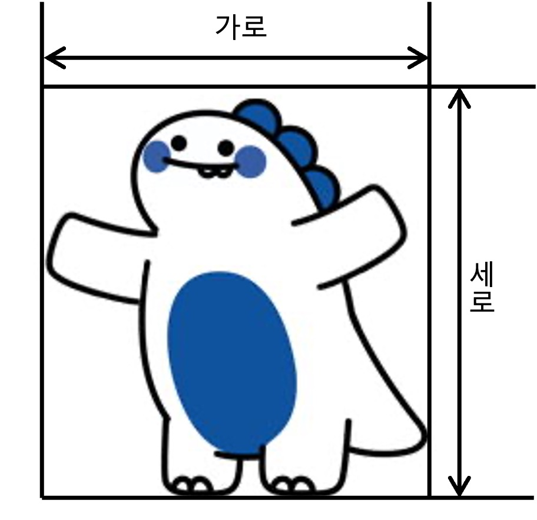 

- 사용할 수 있는 캐릭터는 `티노` 한 마리(?) 이다.
- 티노는 `가로 1.2m`, `세로 1.6m`의 크기를 갖는다.

 

- 플레이어 캐릭터는 가운데를 중심점으로 한다.
- 플레이어 캐릭터의 처음 x축 위치는 2m이다.
- 플레이어 캐릭터의 y축 위치는 3.5m로 고정되어 있다.
- 플레이어 캐릭터는 6.5m/s의 속도로 오른쪽과 왼쪽 중 어느 한 방향을 향해 움직인다. 
- 플레이어 캐릭터는 처음 시작할 때 오른쪽을 향하고 있다.
- 사용자가 화면을 터치하여 플레이어 캐릭터의 방향을 반대 방향으로 전환할 수 있다.
- 플레이어 캐릭터가 게임 월드 가장자리에 닿을 경우 반대 방향으로 전환된다.
- 플레이어 캐릭터는 중력가속도(9.8m/s²)의 영향을 받아 점점 내려가는 속도가 빠르게 보인다.
- 플레이어 캐릭터의 내려가는 최대 속도는 제한되어 있다. (※1.4. 낙하산 상세 항목 참고)
- 플레이어 캐릭터가 장애물과 충돌하는 경우 게임 결과를 표시한다. (※1.3. 장애물 상세 항목 참고)

#### 1.2.1. 플레이어 캐릭터 상태 상세
플레이어 캐릭터 티노는 다음 상태와 애니메이션을 갖는다.

<b>1. Default</b> 
 
- 위의 애니메이션을 보여준다.
- 사용자가 화면을 터치하여 이동 방향을 전환할 수 있다.
- 낙하산의 내구도가 30을 초과할 경우 해당 상태로 변경된다.

<b>2. Happy</b> 
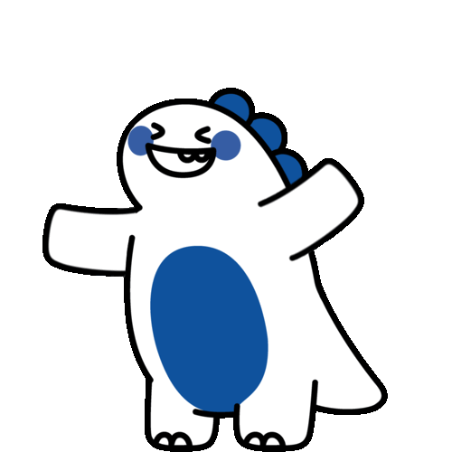 
- 위의 애니메이션을 보여준다.
- 사용자가 화면을 터치하여 이동 방향을 전환할 수 있다.
- 아이템을 획득할 경우 해당 상태로 변경되며, 3초 이후 원래 상태로 복귀한다.

<b>3. Scared</b> 
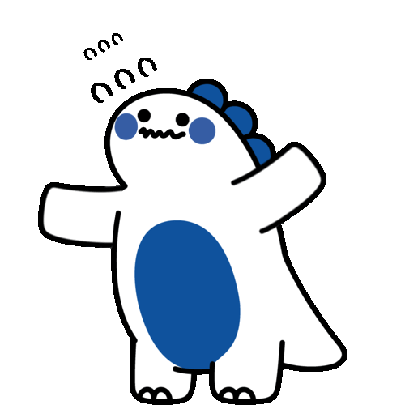 
- 위의 애니메이션을 보여준다.
- 사용자가 화면을 터치하여 이동 방향을 전환할 수 있다.
- 낙하산의 내구도가 30이하일 경우 해당 상태로 변경된다.

<b>4. Dive</b> 
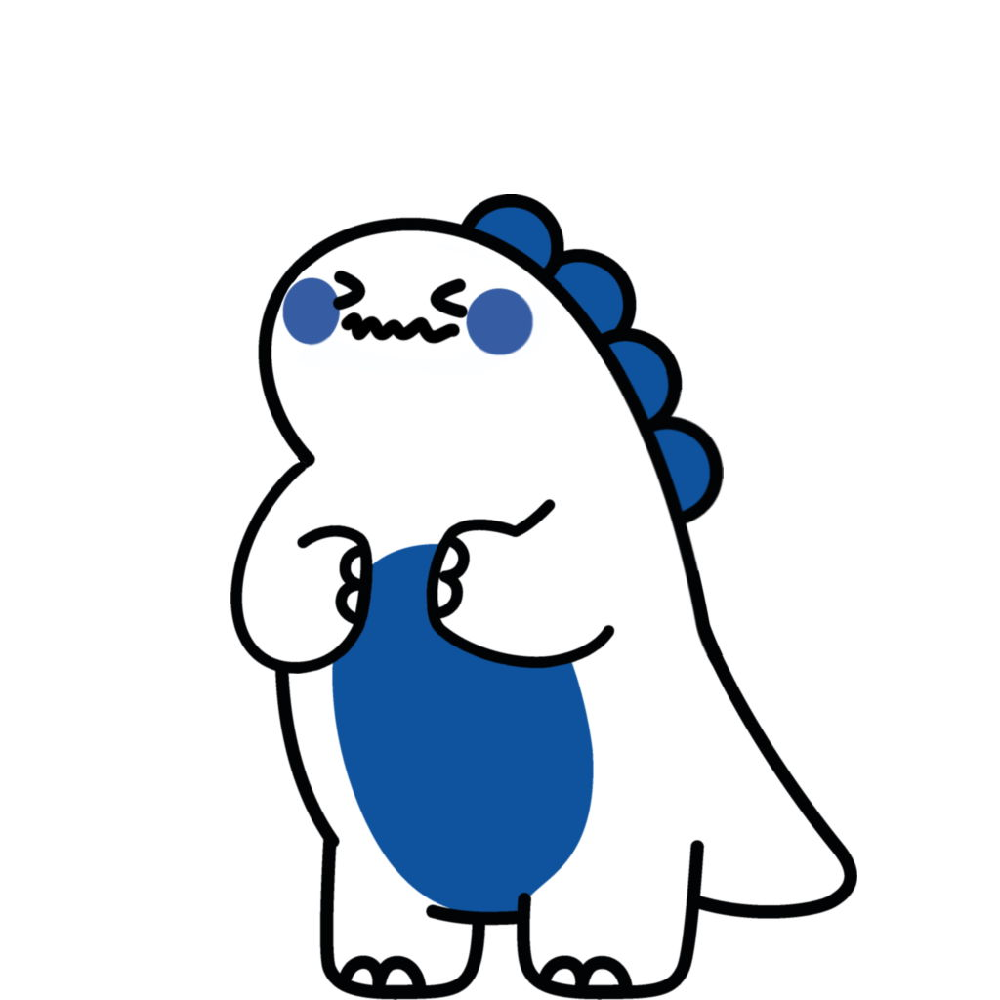 
- 위의 이미지를 보여준다.
- 사용자가 플레이어 캐릭터를 조종할 수 없다.
- 낙하산의 내구도가 0인경우 해당 상태로 변경된다.

<b>5. Invincible</b> 
 
- 위의 애니메이션을 보여준다.
- 사용자가 플레이어 캐릭터를 조종할 수 없다.
- 에너지 음료 아이템을 획득할 경우 해당 상태로 변경된다.

 

플레이어 캐릭터는 게임 종료 애니메이션을 보여주며 게임 결과를 표시한다.  
게임 종료 애니메이션은 2가지가 있으며 각각 상황에 따라 다른 애니메이션이 표시된다.  

<b>1. Crash</b> 
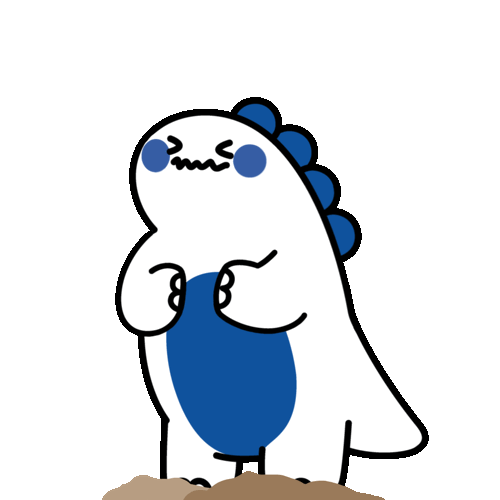
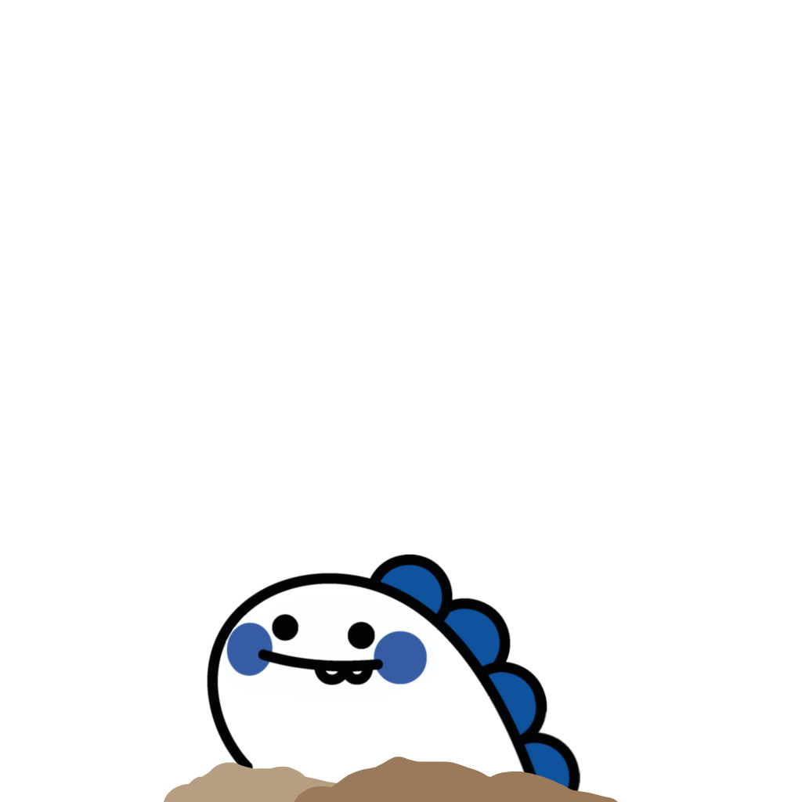 
- Dive상태일 때 게임 오버 처리가 발생할 경우 해당 상태로 변경된다.
- 위의 애니메이션을 보여준다.
- 해당 애니메이션을 보여준 후, 게임의 결과를 표시한다.

<b>2. Landing</b> 

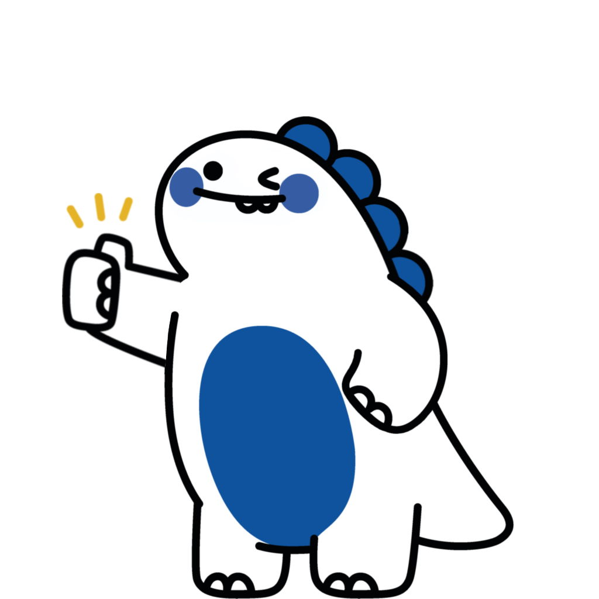 
- Dive상태가 아닐 때 게임 오버 처리가 발생할 경우 해당 상태로 변경된다.
- 위의 이미지를 보여준다.
- 해당 이미지를 보여준 후, 게임의 결과를 표시한다.

### 1.3. 장애물 상세

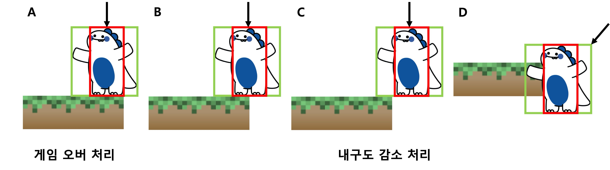 

- 장애물은 고정된 장애물과 움직이는 장애물로 나뉜다.
- 고정된 장애물과 움직이는 장애물은 무작위로 생성된다
- 모든 장애물의 세로 길이의 절댓값은 1m이다.
- 모든 장애물은 y축이 48m인 위치에서 이전 장애물과의 거리가 18m가 될 때 생성된다. 
- 모든 장애물의 y축 위치는 플레이어 캐릭터의 속도에 따라 움직인다.
- 장애물의 y축 위치가 -16m ~ 48m를 초과할 경우 비활성화 상태가 된다.
- 위의 그림에서 A와 같은 경우 게임 결과를 표시하고, B, C, D의 경우에는 낙하산의 내구도를 감소시킨다. 

#### 1.3.1. 고정된 장애물
- 고정된 장애물은 오른쪽 장애물과 왼쪽 장애물이 한 쌍을 이룬다.
- 오른쪽 장애물은 오른쪽 가운데를 중점으로, 왼쪽 장애물은 왼쪽 가운데를 중점으로 한다.
- 고정된 장애물을 이루는 오른쪽 장애물과 왼쪽 장애물의 y축 위치는 같다.
- 고정된 장애물을 이루는 각 장애물의 가로 길이의 절댓값은 0.5m ~ 4.3m사이의 무작위한 값으로 고정된다.
- 고정된 장애물은 서로 만나지 않으며, <b>오른쪽 장애물과 왼쪽 장애물은 항상 4.2m만큼 떨어져 있다</b>. 
즉, 한쪽 장애물의 크기가 정해질 경우 다른쪽 장애물의 크기도 정해진다.

#### 1.3.2. 움직이는 장애물
- 움직이는 장애물은 가운데를 중점으로 한다.
- 움직이는 장애물의 x축 위치는 0m ~ 9m 사이에서 움직인다.
- 움직이는 장애물의 움직이는 속도는 1m/s ~ 9m/s사이의 무작위한 값을 갖는다.
- 움직이는 장애물의 가로 길이의 절댓값은 1m ~ 7m사이의 무작위한 값으로 고정된다.

### 1.4. 낙하산 상세
- 낙하산은 0 ~ 120 사이의 내구도를 갖는다.
- 낙하산의 내구도는 초당 시간에 비례하여 소모된다.
- 게임의 \"좋아요\" 아이템을 통해 낙하산의 내구도를 늘리거나, 시간에 비례하여 소모되는 내구도를 낮출 수 있다.
- 낙하산에 내구도에 비례하여 9m/s ~ 18m/s 사이의 최대 낙하 속도를 갖는다.
- 낙하산의 강화 표는 아래와 같다.

|        | Lv0 | Lv1 | Lv2 | Lv3 | Lv4 | Lv5 |
|--------|:---:|:---:|:---:|:---:|:---:|:---:|
|최대 내구도| 100 | 104 | 108 | 112 | 116 | 120 |
|초당 소모량|  20 |  18 |  16 |  14 |  12 |  10 |
|소모 재화량| 100 | 120 | 140 | 160 | 180 | 200 |

- 내구도가 0이 될 경우 플레이어 캐릭터를 조작할 수 없다.
- 내구도가 0이 될 경우 플레이어 캐릭터 수직으로 떨어진다. (게임은 장애물에 부딪치기 전까지 계속 진행됨)
- 내구도가 0이 될 경우 최대 낙하 속도는 36m/s까지 증가한다.
- 내구도가 0이 되었을 때, 어떤 아이템을 먹어도 효과가 적용되지 않는다. (단, 코인 아이템은 예외)

### 1.5. 아이템 상세

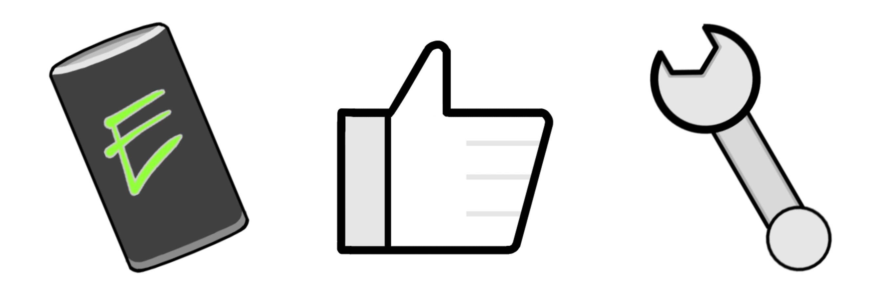

- 아이템은 `에너지 음료`, `좋아요`, `스패너` 3가지가 있다.
- 3가지 아이템은 무작위로 등장한다.
- 모든 아이템은 가운데를 중점으로 한다.
- 모든 아이템의 가로와 세로의 크기는 1m이다.
- 모든 아이템은 y축이 48m인 위치에서 생성된다.
- 모든 아이템의 y축 위치가 -16m ~ 48m를 초과할 경우 비활성화 상태가 된다.
- 모든 아이템은 이전 장애물과 다음 장애물 중심에 x축이 0.8m ~ 8.2m 사이 무작위한 위치에 존재한다.
- 플레이어 캐릭터와 아이템이 충돌할 경우 플레이어 캐릭터는 아이템의 효과를 적용받는다.

#### 1.5.1. 에너지 음료 아이템
- 플레이어 캐릭터가 6초간 무적상태가 된다.
- 무적상태에서 낙하산의 내구도는 소모되지 않는다.
- 무적상태에서 최대 낙하 속도는 36m/s까지 증가한다.

#### 1.5.2. 좋아요 아이템
- 게임의 재화 역할을 한다.
- 게임 내 좋아요 횟수를 1증가시킨다.

#### 1.5.3. 스패너 아이템
- 낙하산의 내구도를 10만큼 증가시킨다.

 

## 2. 개발 범위
- `Behavior Tree`를 사용한 플레이어 처리.
- `Bounding Box`를 사용한 충돌 처리.
- `Object Pool`을 사용한 장애물 생성 및 소멸.
- 범위 내 랜덤한 길이를 가진 장애물 생성 및 배치.
- 범위 내 랜덤한 아이템 생성 및 배치.
- 아이템을 획득할 경우의 아이템 효과 처리.
- 티노가 낙하한 거리를 화면에 표시한다.
- 사용자의 터치 입력 처리.

 

## 3. 예상 게임 실행 흐름
### 3.1. 전체 실행 흐름

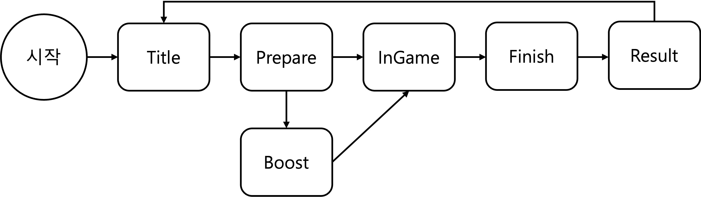 

#### 3.1.1. Intro
- 게임의 인트로 화면을 보여줍니다.
- 게임의 데이터를 로드합니다.

#### 3.1.2. Title
- 메뉴 버튼들을 화면에 보여줍니다.
- 메뉴 버튼에는 `실험 시작`, `낙하산 정비`, `실험 종료`가 있습니다.
- `실험 시작` 버튼을 누른 경우 `InGame`으로 전환됩니다.
- `낙하산 정비` 버튼을 누른 경우 `Garage`로 전환됩니다.
- `실험 종료` 버튼을 누른 경우 애플리케이션을 종료합니다.

#### 3.1.3. Garage
- 게임 내 재화(좋아요)를 통해 낙하산을 강화할 수 있습니다.

#### 3.1.4. InGame
1. Prepare
- 티노가 화면 위쪽에서 천천히 내려오면서 게임이 시작되려 함을 사용자에게 보입니다.

2. Run
- 게임을 진행합니다.

3. Finish
- 게임 오버 애니메이션을 보여준 후에 게임 결과를 표시하고 기록을 갱신합니다.

 

### 3.2. 게임 실행 흐름
> Nintendo DSi의 `종이비행기`게임과 비슷하다.  

- 밑에서 위로 오른쪽 또는 왼쪽에 랜덤한 길이의 장애물이 나온다.
- 플레이어는 오른쪽 또는 왼쪽 방향으로만 이동한다.
- 배경이 움직이면서 플레이어가 이동하는 것 처럼 보이게 만든다.

 

## 4. 개발 일정
#### 1주차 (04/04~04/11) 
- [x] 개발자 코딩 컨벤션 문서화.
- [x] Android 프로젝트 생성 및 설정.
- [x] 게임 월드의 세부 단위 결정.
- [x] 게임에 필요한 리소스 수집.

#### 2주차 (04/12~04/18)
- [ ] 게임에서 사용되는 Renderer 구현.
- [ ] 게임에서 사용되는 벡터 자료형 및 수학 함수 구현.

#### 3주차 (04/19~04/25)
- [ ] Behavior Tree를 이용한 각 행동에 따른 플레이어의 움직임 구현.
- [ ] 사용자 입력으로 플레이어 조종 구현.

#### 4주차 (04/26~05/02)
- [ ] 랜덤한 크기나 위치 혹은 움직이는 장애물 오브젝트 생성.
- [ ] 아래에서 위로 올라오는 장애물 오브젝트의 구현.

#### 5주차 (05/03~05/09)
- [ ] Object Pool을 이용한 장애물 오브젝트 생성 및 소멸 최적화.
- [ ] 배경이 아래에서 위로 천천히 움직이는 것을 구현.

#### 6주차 (05/10~05/16)
- [ ] 충돌처리를 위한 Bounding Box 자료형 생성.
- [ ] 플레이어와 장애물 오브젝트 충돌시 게임 오버 처리.

#### 7주차 (05/17~05/23)
- [ ] 플레이어가 장애물 오브젝트를 피한 경우 점수를 증가시킨다.
- [ ] 플레이어의 점수를 화면 맨 위쪽 가운데에 표시.

#### 8주차 (05/24~05/30)
- [ ] 게임 타이틀 장면 생성.
- [ ] 게임 타이틀 장면과 게임 플레이 장면을 연결.

#### 9주차 (05/31~06/06)
- [ ] 게임 QA및 버그 수정.
- [ ] 프로젝트 마무리.
